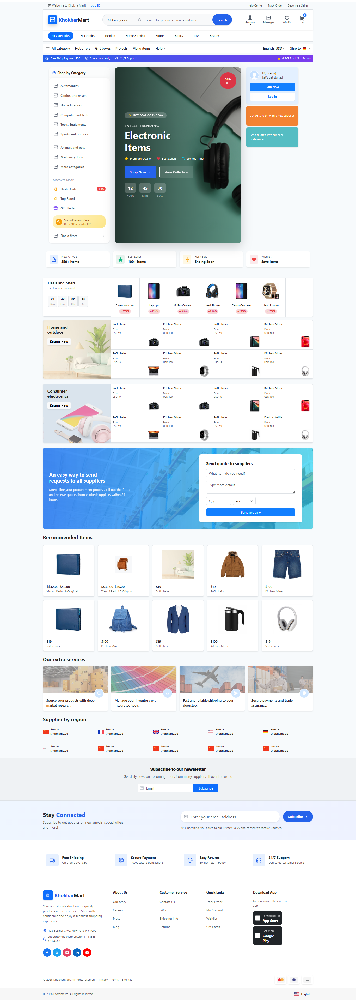
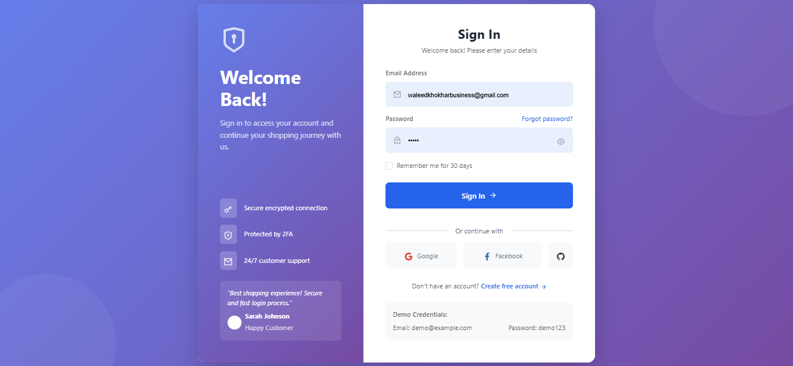
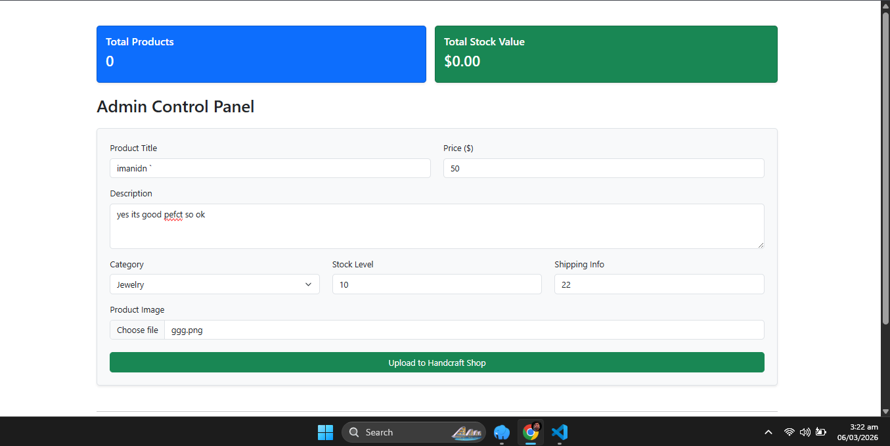
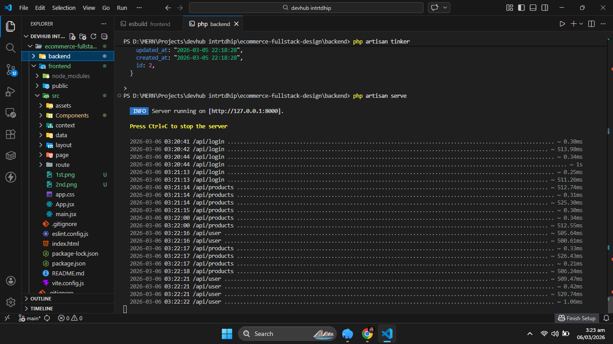

# 🛍️ E-Commerce Full-Stack Platform

## 📋 Overview
A modern, feature-rich e-commerce platform with a stunning UI, secure authentication, and seamless product management. This project was developed during my internship at **Developers Hub Corporation** as part of the frontend design task.

## ✨ Key Features
- 🔐 **User Authentication** - Secure login/register functionality
- 🎨 **Modern UI/UX** - Fully responsive with stunning gradients and animations
- 🛒 **Shopping Experience** - Product browsing and cart management
- 📱 **Mobile First** - Perfectly optimized for all devices
- 👑 **Role-Based Access** - Different views for admin and users
- 🔍 **Product Search** - Advanced filtering and search capabilities

## 📸 Screenshots

*Modern homepage with hero section, category menu, and featured products*

*Sleek signup/login interface with gradient design and social login options*

*Admin panel*

*vs code secrenshort*

## 🎯 Key Highlights
- Clean, professional UI with consistent design language
- Smooth animations and hover effects throughout
- Fully responsive across all devices
- User-friendly interface with intuitive navigation
- Modern gradient designs and card layouts

---

## 👨‍💻 Developer

### **Waleed Khokhar**

#### *Full-Stack Developer | AI Enthusiast | DevOps Learner*

🎓 **Education:** BSCS Graduate  
💻 **Expertise:** MERN Stack | AI Integration | Data Analytics | DevOps Practices

### 🚀 About Me
Passionate full-stack developer with a strong foundation in modern web technologies. I specialize in creating responsive, user-friendly applications with clean code and intuitive designs. Currently exploring AI integration and DevOps practices to build more intelligent and scalable solutions.

---

### 🌐 Connect With Me

| Platform | Link |
|----------|------|
| 📌 **Portfolio** | [waledkhokar.vercel.app](https://waledkhokar.vercel.app) |
| 💼 **LinkedIn** | [linkedin.com/in/waleed-khokhar-8ba554261](https://www.linkedin.com/in/waleed-khokhar-8ba554261) |
| 🐙 **GitHub** | [github.com/waleedkhokar](https://github.com/waleedkhokar) 

  

  Built with ❤️ by <strong>Waleed Khokhar</strong> | Developers Hub Corporation Internship 2026
  

